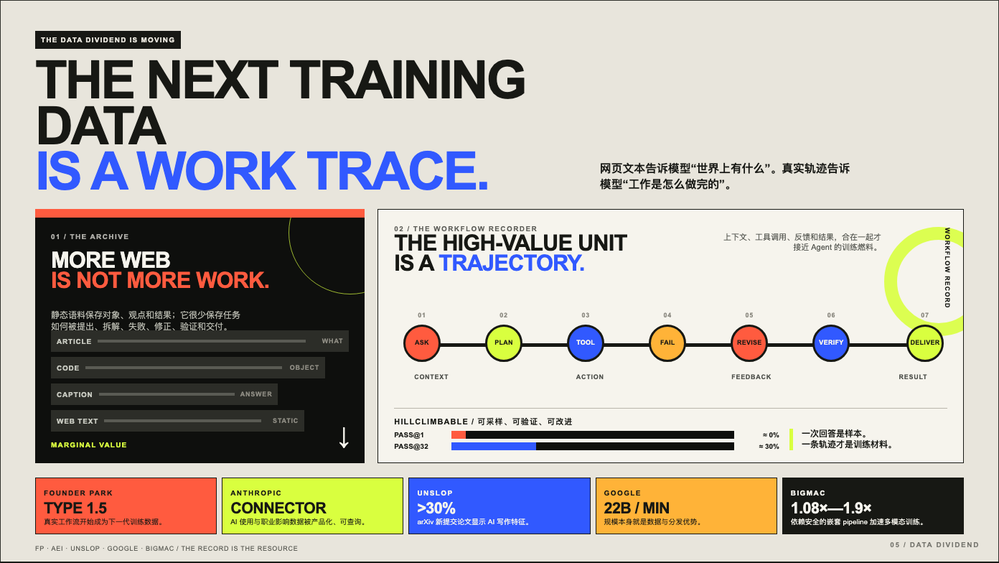

# Designer Consultancy

A compact design practice for agentic product work: research, systems, UI, interaction, critique, and evidence-led visual direction. The skills are written for agents, but are designed to preserve human judgment.

## Compatibility

| Runtime | Support |
| --- | --- |
| Claude Code | Plugin collections through `.claude-plugin/marketplace.json` |
| Codex | Native `SKILL.md` folders, installed per project or per user |
| Gemini CLI | Generated extensions through `scripts/build-gemini.sh` |

## Design practice

**101 skills, 30 commands, 9 design plugins.**

| Plugin | Skills | Commands | Focus |
| --- | ---: | ---: | --- |
| `design-research` | 12 | 4 | Research, synthesis, and evidence |
| `design-systems` | 11 | 3 | Tokens, components, and system rules |
| `ux-strategy` | 12 | 3 | Journeys, flows, and product direction |
| `ui-design` | 18 | 4 | Interfaces, visual language, and templates |
| `interaction-design` | 16 | 3 | States, motion, and behavior |
| `prototyping-testing` | 8 | 4 | Prototypes and usability loops |
| `design-ops` | 9 | 3 | Handoff, documentation, and governance |
| `designer-toolkit` | 7 | 3 | Practical design utilities |
| `visual-critique` | 8 | 3 | Quality, hierarchy, and anti-slop review |

## Install

### Codex

Codex discovers a skill at `.codex/skills/<skill-name>/SKILL.md`. Install the whole practice set into the current project:

```bash
git clone https://github.com/chengjialu8888/designer-consultancy.git /tmp/designer-consultancy
mkdir -p .codex/skills
cp -R /tmp/designer-consultancy/ui-design/skills/. .codex/skills/
cp -R /tmp/designer-consultancy/visual-critique/skills/. .codex/skills/
```

For a personal install, replace `.codex/skills` with `~/.codex/skills`. To install one collection, copy only that plugin's `skills/` directory. Start a new Codex session after installation so the skill index refreshes.

The `commands/` directories remain portable workflow references. In Codex, invoke the matching skill by name and use those command documents as supporting guidance; they are not treated as a separate command registry.

### Claude Code

```text
/plugin marketplace add chengjialu8888/designer-consultancy
/plugin install ui-design@designer-skills
```

### Gemini CLI

```bash
git clone https://github.com/chengjialu8888/designer-consultancy.git /tmp/designer-consultancy
cd /tmp/designer-consultancy
./scripts/build-gemini.sh
```

The generated extensions live in `.gemini/extensions/`. Copy that directory into the project or user-level Gemini extensions directory as needed.

## Start here

| Need | Start with |
| --- | --- |
| Design a product or interface | `ui-design` |
| Audit an existing screen | `visual-critique` |
| Build a research-backed direction | `design-research` |
| Create an exhibition-style AI report | `contemporary-exhibition-editorial` |
| Create a restrained editorial poster | `minimal-zine-poster` |
| Review generated work for generic patterns | `anti-ai-slop` |

## Visual directions

These are reusable design methods, not locked themes. Use the skill instructions as constraints, then adapt the composition to the content.

| Direction | Best for | Preview |
| --- | --- | --- |
| [Contemporary Exhibition Editorial](ui-design/skills/contemporary-exhibition-editorial/SKILL.md) | Evidence-led reports and 16:9 editorial pages |  |
| [Minimal Zine Poster](ui-design/skills/minimal-zine-poster/SKILL.md) | Quiet posters, covers, and single-idea summaries |   |

## Artist-derived methods

The artist methods are abstracted into composition, color, material, and rhythm rules rather than imitation.

| Method | Useful for |
| --- | --- |
| [Georgia O'Keeffe Style](ui-design/skills/georgia-okeeffe-style/SKILL.md) | Organic scale, concentrated color, and close looking |
| [Mark Rothko Style](ui-design/skills/mark-rothko-style/SKILL.md) | Color fields, atmospheric hierarchy, and emotional pacing |

## Repository map

- `*/skills/`: agent-readable design methods, each with a `SKILL.md`
- `*/commands/`: repeatable workflow references for Claude Code and portable agent use
- `ui-design/examples/`: rendered examples and visual references
- `scripts/build-gemini.sh`: converts plugin skills into Gemini CLI extensions
- `.claude-plugin/marketplace.json`: Claude Code marketplace metadata

## Contributing

Add a focused skill when it captures a repeatable design judgment. Include a clear `SKILL.md`, keep examples close to the skill, and explain when the method should not be used. Small, opinionated contributions are easier to reuse and review.

MIT License.
