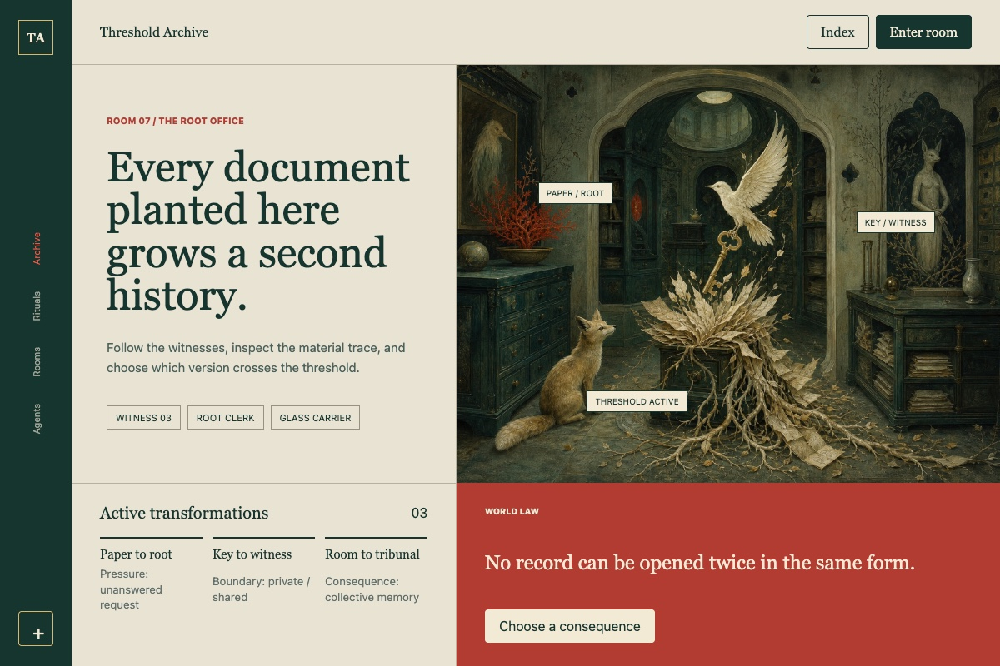
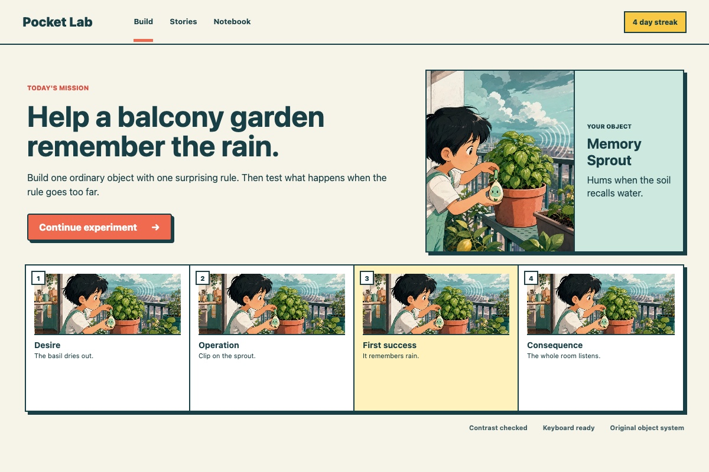
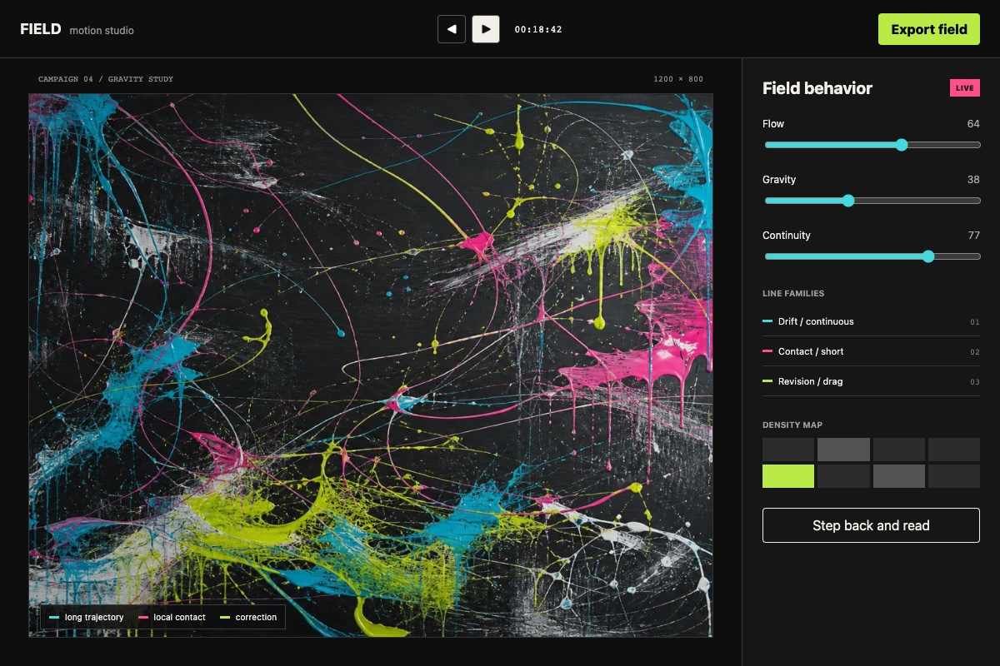
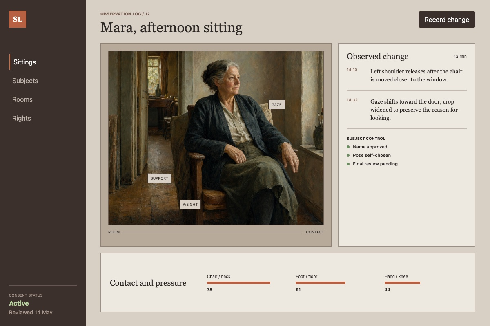
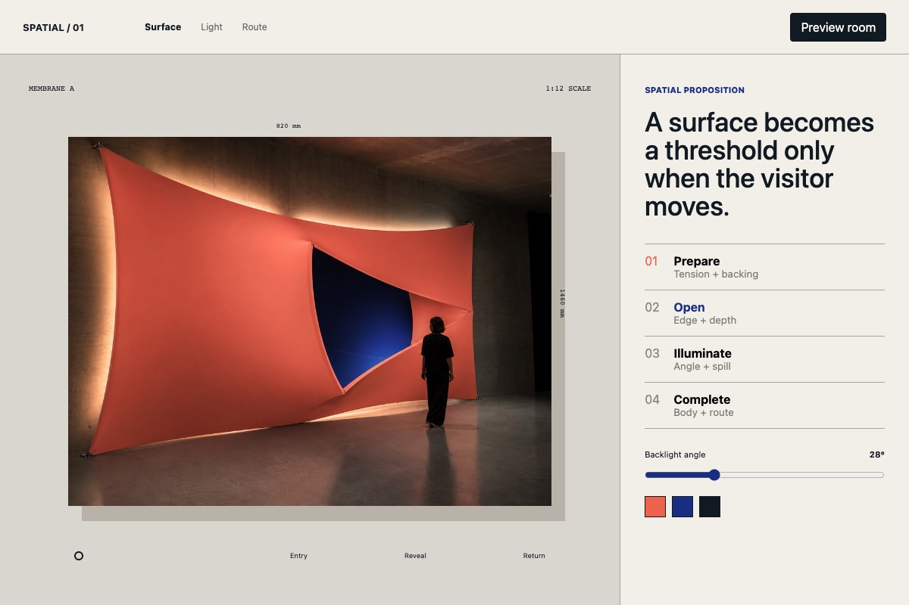
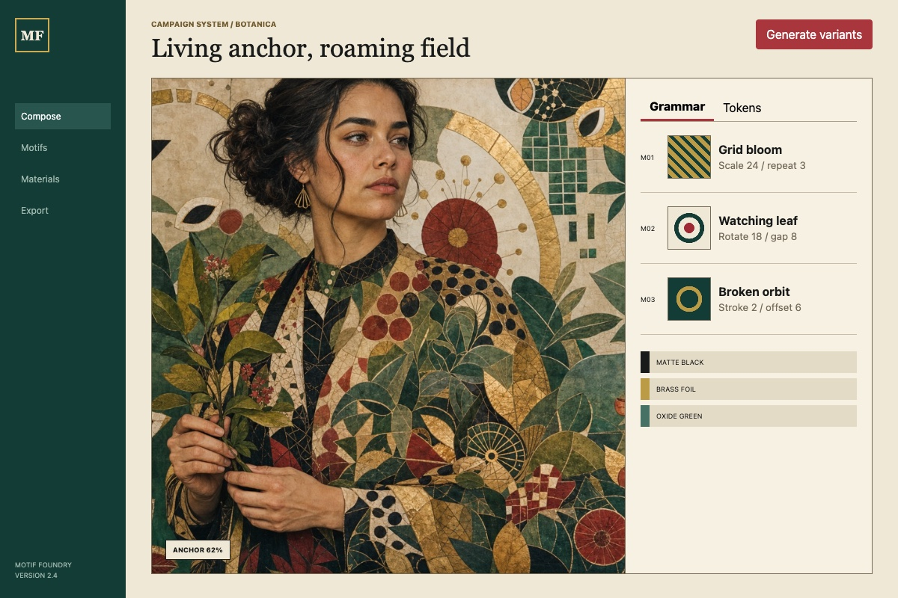
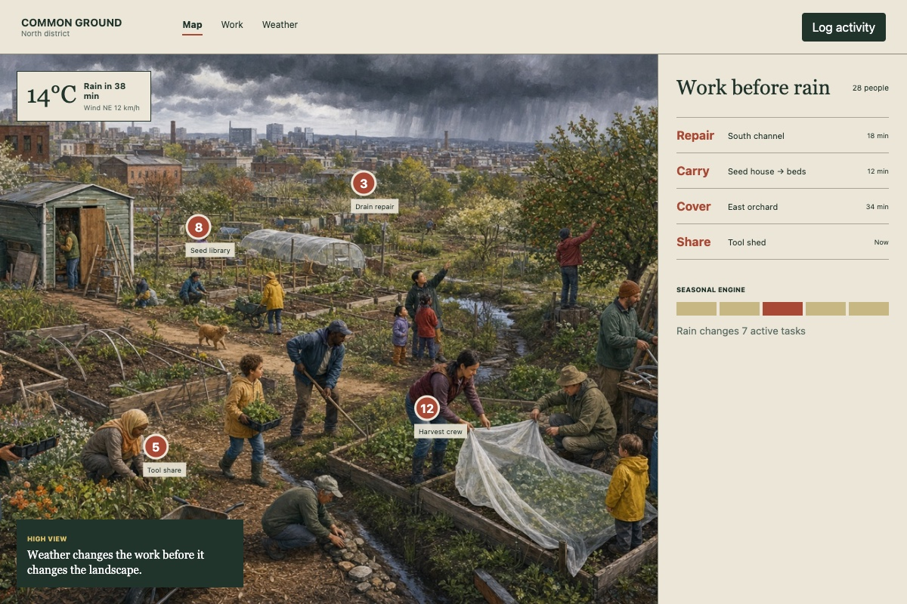
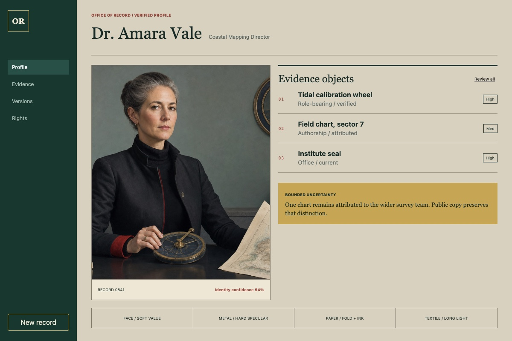
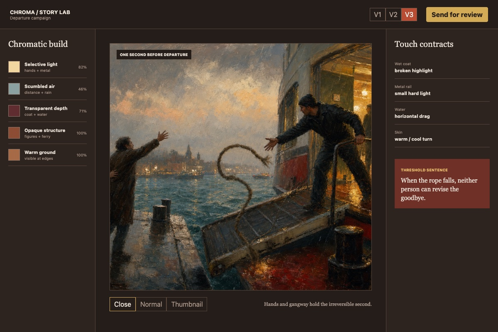
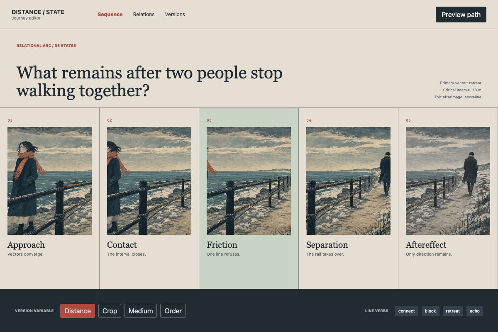

# Designer Consultancy

A compact design practice for agentic product work: research, systems, UI, interaction, critique, and evidence-led visual direction. The skills are written for agents, but are designed to preserve human judgment.

## Compatibility

| Runtime | Support |
| --- | --- |
| Claude Code | Plugin collections through `.claude-plugin/marketplace.json` |
| Codex | Native `SKILL.md` folders, installed per project or per user |
| Gemini CLI | Generated extensions through `scripts/build-gemini.sh` |

## Design practice

**116 skills, 30 commands, 10 design plugins.**

| Plugin | Skills | Commands | Focus |
| --- | ---: | ---: | --- |
| `design-research` | 12 | 4 | Research, synthesis, and evidence |
| `design-systems` | 11 | 3 | Tokens, components, and system rules |
| `ux-strategy` | 12 | 3 | Journeys, flows, and product direction |
| `ui-design` | 28 | 4 | Interfaces, visual language, and templates |
| `interaction-design` | 16 | 3 | States, motion, and behavior |
| `prototyping-testing` | 8 | 4 | Prototypes and usability loops |
| `design-ops` | 9 | 3 | Handoff, documentation, and governance |
| `designer-toolkit` | 7 | 3 | Practical design utilities |
| `visual-critique` | 8 | 3 | Quality, hierarchy, and anti-slop review |
| `blog` | 5 | 0 | WeChat editorial layout, imagery, HTML, and draft preparation |

## Install

### Codex

Codex discovers a skill at `.codex/skills/<skill-name>/SKILL.md`. Install the whole practice set into the current project:

```bash
git clone https://github.com/chengjialu8888/designer-consultancy.git /tmp/designer-consultancy
mkdir -p .codex/skills
cp -R /tmp/designer-consultancy/ui-design/skills/. .codex/skills/
cp -R /tmp/designer-consultancy/visual-critique/skills/. .codex/skills/
cp -R /tmp/designer-consultancy/blog/skills/. .codex/skills/
```

For a personal install, replace `.codex/skills` with `~/.codex/skills`. To install one collection, copy only that plugin's `skills/` directory. Start a new Codex session after installation so the skill index refreshes.

The `commands/` directories remain portable workflow references. In Codex, invoke the matching skill by name and use those command documents as supporting guidance; they are not treated as a separate command registry.

### Claude Code

```text
/plugin marketplace add chengjialu8888/designer-consultancy
/plugin install ui-design@designer-skills
/plugin install blog@designer-skills
```

### Gemini CLI

```bash
git clone https://github.com/chengjialu8888/designer-consultancy.git /tmp/designer-consultancy
cd /tmp/designer-consultancy
./scripts/build-gemini.sh
```

The generated extensions live in `.gemini/extensions/`. Copy that directory into the project or user-level Gemini extensions directory as needed.

## Start here

| Need | Start with |
| --- | --- |
| Design a product or interface | `ui-design` |
| Audit an existing screen | `visual-critique` |
| Build a research-backed direction | `design-research` |
| Create an exhibition-style AI report | `contemporary-exhibition-editorial` |
| Create a restrained editorial poster | `minimal-zine-poster` |
| Review generated work for generic patterns | `anti-ai-slop` |
| Format a WeChat Official Account article | `blog` |
| Browse WeChat theme case screenshots | [blog theme gallery](blog/README.md#theme-gallery) |
| Explore artist-derived design styles | [Artist-derived methods](#artist-derived-methods-design-styles) |

## Visual directions

These are reusable design methods, not locked themes. Use the skill instructions as constraints, then adapt the composition to the content.

| Direction | Best for | Preview |
| --- | --- | --- |
| [Contemporary Exhibition Editorial](ui-design/skills/contemporary-exhibition-editorial/SKILL.md) | Evidence-led reports and 16:9 editorial pages |  |
| [Minimal Zine Poster](ui-design/skills/minimal-zine-poster/SKILL.md) | Quiet posters, covers, and single-idea summaries |   |

## Artist-derived methods: design styles

These artist-derived design styles translate documented composition, color, material, space, and rhythm principles into reusable rules for art direction, image prompts, editorial systems, brand work, product illustration, and critique. They are methods of design, not instructions to imitate a specific artwork.

### Method diagrams

Each diagram shows how a method changes frontend information architecture, hierarchy, controls, states, and rhythm. The examples combine browser-rendered HTML/CSS interfaces with original generated visual assets directed by each artist-derived method; the main artwork is not simulated with CSS geometry. Their reusable source lives in the [frontend specimen renderer](ui-design/examples/artist-derived-methods/frontend/).

| Design style | Frontend translation | Method diagram |
| --- | --- | --- |
| [Georgia O'Keeffe Style](ui-design/skills/georgia-okeeffe-style/SKILL.md) | Organic scale, concentrated color, and close looking |  |
| [Mark Rothko Style](ui-design/skills/mark-rothko-style/SKILL.md) | Color fields, atmospheric hierarchy, and emotional pacing |  |
| [Leonora Carrington Style](ui-design/skills/leonora-carrington-style/SKILL.md) | Threshold archive: world law, autonomous agents, nested rooms, transformation states, and consequential choices |  |
| [Fujiko F. Fujio Visual Narrative Style](ui-design/skills/doraemon-style/SKILL.md) | Child-readable maker flow: one clear action per unit, an everyday science-fiction rule, and a visible causal sequence |  |
| [Jackson Pollock Style](ui-design/skills/jackson-pollock-style/SKILL.md) | Generative motion studio: parameterized line families, uneven density, feedback passes, and three-distance reading |  |
| [Lucian Freud Style](ui-design/skills/lucian-freud-style/SKILL.md) | Observational sitting log: figure-room reciprocity, contact pressure, visible agency, and change over time |  |
| [Lucio Fontana Style](ui-design/skills/lucio-fontana-style/SKILL.md) | Spatial configurator: surface preparation, aperture depth, backlight, and a visitor route that completes the work |  |
| [Gustav Klimt Style](ui-design/skills/gustav-klimt-style/SKILL.md) | Motif system editor: a protected living anchor, executable pattern grammar, material tokens, and controlled ornament |  |
| [Pieter Bruegel the Elder Style](ui-design/skills/pieter-bruegel-the-elder-style/SKILL.md) | Community operations map: high-view organization, seasonal causality, many legible verbs, and whole-to-detail discovery |  |
| [Hans Holbein the Younger Style](ui-design/skills/hans-holbein-the-younger-style/SKILL.md) | Institutional profile: selective precision, role-bearing evidence, material-specific rendering, and bounded uncertainty |  |
| [Titian Style](ui-design/skills/titian-style/SKILL.md) | Chromatic revision workspace: functional layers, material touch contracts, an irreversible narrative second, and distance checks |  |
| [Edvard Munch Style](ui-design/skills/edvard-munch-style/SKILL.md) | Relational journey editor: state sequence, directional line verbs, critical intervals, and controlled version changes |  |

## Repository map

- `*/skills/`: agent-readable design methods, each with a `SKILL.md`
- `*/commands/`: repeatable workflow references for Claude Code and portable agent use
- `ui-design/examples/`: rendered examples and visual references
- `blog/`: WeChat Official Account editorial workflow and themes
- `scripts/build-gemini.sh`: converts plugin skills into Gemini CLI extensions
- `.claude-plugin/marketplace.json`: Claude Code marketplace metadata

## Contributing

Add a focused skill when it captures a repeatable design judgment. Include a clear `SKILL.md`, keep examples close to the skill, and explain when the method should not be used. Small, opinionated contributions are easier to reuse and review.

MIT License.
