# Designer Consultancy

A compact design practice for agentic product work: research, systems, UI, interaction, critique, and evidence-led visual direction. The skills are written for agents, but are designed to preserve human judgment.

## Compatibility

| Runtime | Support |
| --- | --- |
| Claude Code | Plugin collections through `.claude-plugin/marketplace.json` |
| Codex | Native `SKILL.md` folders, installed per project or per user |
| Gemini CLI | Generated extensions through `scripts/build-gemini.sh` |

## Design practice

**116 skills, 30 commands, 10 design plugins.**

| Plugin | Skills | Commands | Focus |
| --- | ---: | ---: | --- |
| `design-research` | 12 | 4 | Research, synthesis, and evidence |
| `design-systems` | 11 | 3 | Tokens, components, and system rules |
| `ux-strategy` | 12 | 3 | Journeys, flows, and product direction |
| `ui-design` | 28 | 4 | Interfaces, visual language, and templates |
| `interaction-design` | 16 | 3 | States, motion, and behavior |
| `prototyping-testing` | 8 | 4 | Prototypes and usability loops |
| `design-ops` | 9 | 3 | Handoff, documentation, and governance |
| `designer-toolkit` | 7 | 3 | Practical design utilities |
| `visual-critique` | 8 | 3 | Quality, hierarchy, and anti-slop review |
| `blog` | 5 | 0 | WeChat editorial layout, imagery, HTML, and draft preparation |

## Install

### Codex

Codex discovers a skill at `.codex/skills/<skill-name>/SKILL.md`. Install the whole practice set into the current project:

```bash
git clone https://github.com/chengjialu8888/designer-consultancy.git /tmp/designer-consultancy
mkdir -p .codex/skills
cp -R /tmp/designer-consultancy/ui-design/skills/. .codex/skills/
cp -R /tmp/designer-consultancy/visual-critique/skills/. .codex/skills/
cp -R /tmp/designer-consultancy/blog/skills/. .codex/skills/
```

For a personal install, replace `.codex/skills` with `~/.codex/skills`. To install one collection, copy only that plugin's `skills/` directory. Start a new Codex session after installation so the skill index refreshes.

The `commands/` directories remain portable workflow references. In Codex, invoke the matching skill by name and use those command documents as supporting guidance; they are not treated as a separate command registry.

### Claude Code

```text
/plugin marketplace add chengjialu8888/designer-consultancy
/plugin install ui-design@designer-skills
/plugin install blog@designer-skills
```

### Gemini CLI

```bash
git clone https://github.com/chengjialu8888/designer-consultancy.git /tmp/designer-consultancy
cd /tmp/designer-consultancy
./scripts/build-gemini.sh
```

The generated extensions live in `.gemini/extensions/`. Copy that directory into the project or user-level Gemini extensions directory as needed.

## Start here

| Need | Start with |
| --- | --- |
| Design a product or interface | `ui-design` |
| Audit an existing screen | `visual-critique` |
| Build a research-backed direction | `design-research` |
| Create an exhibition-style AI report | `contemporary-exhibition-editorial` |
| Create a restrained editorial poster | `minimal-zine-poster` |
| Review generated work for generic patterns | `anti-ai-slop` |
| Format a WeChat Official Account article | `blog` |
| Browse WeChat theme case screenshots | [blog theme gallery](blog/README.md#theme-gallery) |
| Explore artist-derived design styles | [Artist-derived methods](#artist-derived-methods-design-styles) |

## Visual directions

These are reusable design methods, not locked themes. Use the skill instructions as constraints, then adapt the composition to the content.

| Direction | Best for | Preview |
| --- | --- | --- |
| [Contemporary Exhibition Editorial](ui-design/skills/contemporary-exhibition-editorial/SKILL.md) | Evidence-led reports and 16:9 editorial pages |  |
| [Minimal Zine Poster](ui-design/skills/minimal-zine-poster/SKILL.md) | Quiet posters, covers, and single-idea summaries |   |

## Artist-derived methods: design styles

These artist-derived design styles translate documented composition, color, material, space, and rhythm principles into reusable rules for art direction, image prompts, editorial systems, brand work, product illustration, and critique. They are methods of design, not instructions to imitate a specific artwork. The visuals below are either method diagrams or generated-image outputs; they are not finished interface, brand, or editorial design screenshots.

### Method diagrams

| Design style | Useful for | Method diagram |
| --- | --- | --- |
| [Georgia O'Keeffe Style](ui-design/skills/georgia-okeeffe-style/SKILL.md) | Organic scale, concentrated color, and close looking | 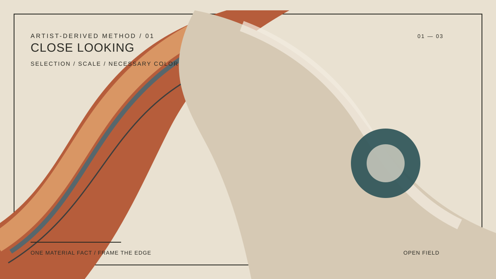 |
| [Mark Rothko Style](ui-design/skills/mark-rothko-style/SKILL.md) | Color fields, atmospheric hierarchy, and emotional pacing | 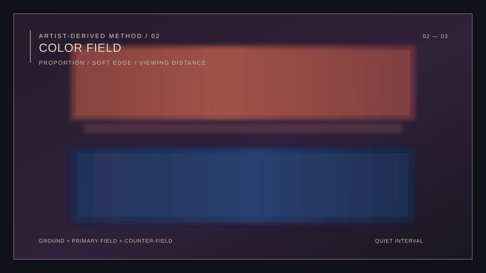 |

### Image-generation examples

The gallery below shows original generated-image outputs created from each design style's operational rules. These are image-generation examples, not screenshots of completed design systems or applications. They are also not reproductions, authorized artist or franchise style guides, or prompt shortcuts based only on a name.

<table>
  <tr>
    <td width="50%" valign="top">
      <a href="ui-design/skills/leonora-carrington-style/SKILL.md"><strong>Leonora Carrington Style</strong></a><br>
      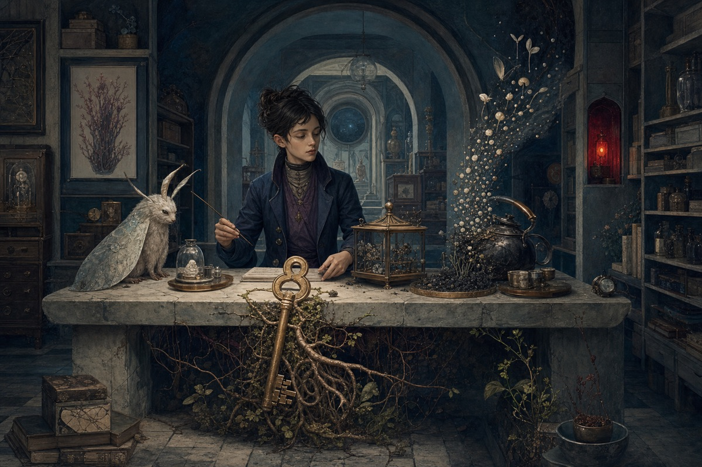<br>
      <sub><strong>Generation focus:</strong> a world law, autonomous agents, domestic ritual, material metamorphosis, and a room that behaves like a social machine.<br><strong>Use for:</strong> narrative worlds, cultural experiences, editorial series, and transformation-led onboarding.</sub>
    </td>
    <td width="50%" valign="top">
      <a href="ui-design/skills/doraemon-style/SKILL.md"><strong>Fujiko F. Fujio Visual Narrative Style</strong></a><br>
      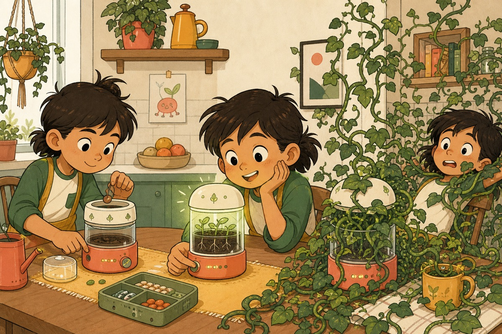<br>
      <sub><strong>Generation focus:</strong> controlled curves, single-beat clarity, everyday science fiction, and a desire-operation-escalation-consequence loop.<br><strong>Use for:</strong> original character systems, child-readable stories, product illustration, and consequence-driven onboarding. Protected characters and gadgets are explicitly excluded.</sub>
    </td>
  </tr>
  <tr>
    <td width="50%" valign="top">
      <a href="ui-design/skills/jackson-pollock-style/SKILL.md"><strong>Jackson Pollock Style</strong></a><br>
      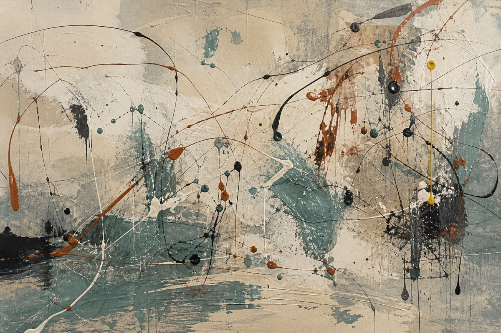<br>
      <sub><strong>Generation focus:</strong> action-observation feedback, gravity and viscosity as collaborators, heterogeneous allover structure, and field-to-particle reading.<br><strong>Use for:</strong> expressive campaigns, motion systems, spatial graphics, and material-led image direction without random splatter filters.</sub>
    </td>
    <td width="50%" valign="top">
      <a href="ui-design/skills/lucian-freud-style/SKILL.md"><strong>Lucian Freud Style</strong></a><br>
      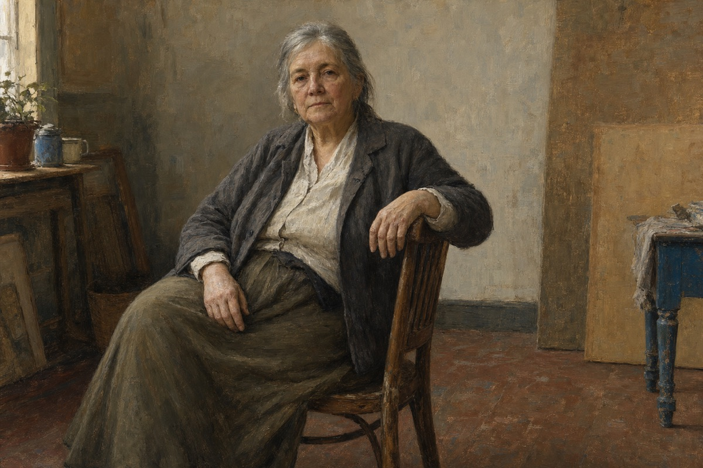<br>
      <sub><strong>Generation focus:</strong> sustained relational observation, paint as bodily structure, contact pressure, reciprocal gaze, and a room that co-constructs the figure.<br><strong>Use for:</strong> portrait direction, editorial imagery, close critique, and material studies with explicit consent and dignity guardrails.</sub>
    </td>
  </tr>
  <tr>
    <td width="50%" valign="top">
      <a href="ui-design/skills/lucio-fontana-style/SKILL.md"><strong>Lucio Fontana Style</strong></a><br>
      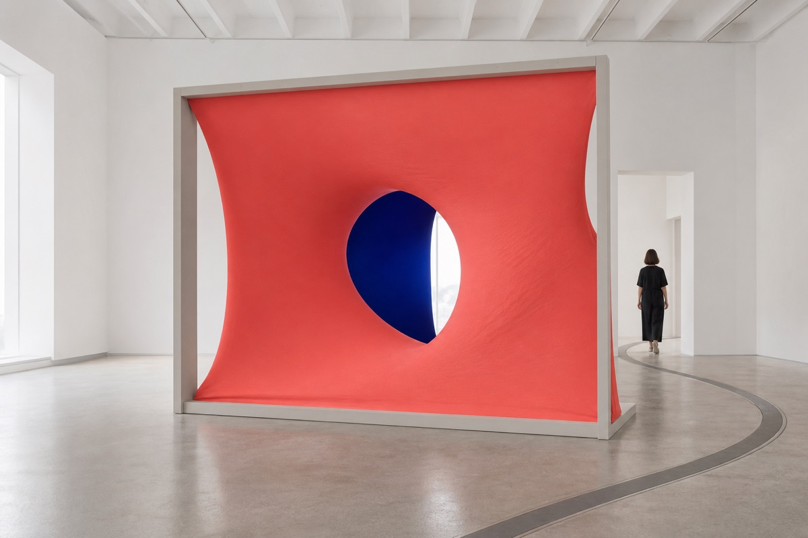<br>
      <sub><strong>Generation focus:</strong> surface as threshold, prepared irreversibility, light as spatial material, and a body completing the work through movement.<br><strong>Use for:</strong> installations, product reveals, spatial identity, motion transitions, and progressive disclosure beyond decorative crack effects.</sub>
    </td>
    <td width="50%" valign="top">
      <a href="ui-design/skills/gustav-klimt-style/SKILL.md"><strong>Gustav Klimt Style</strong></a><br>
      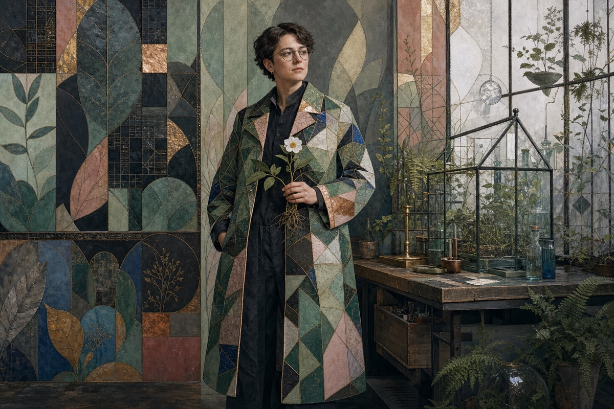<br>
      <sub><strong>Generation focus:</strong> a living anchor against a roaming pattern field, pose before ornament, materialized light, and a production-ready motif grammar.<br><strong>Use for:</strong> portrait-led campaigns, packaging, exhibitions, and brand systems that need patterned richness without a generic gold filter.</sub>
    </td>
  </tr>
  <tr>
    <td width="50%" valign="top">
      <a href="ui-design/skills/pieter-bruegel-the-elder-style/SKILL.md"><strong>Pieter Bruegel the Elder Style</strong></a><br>
      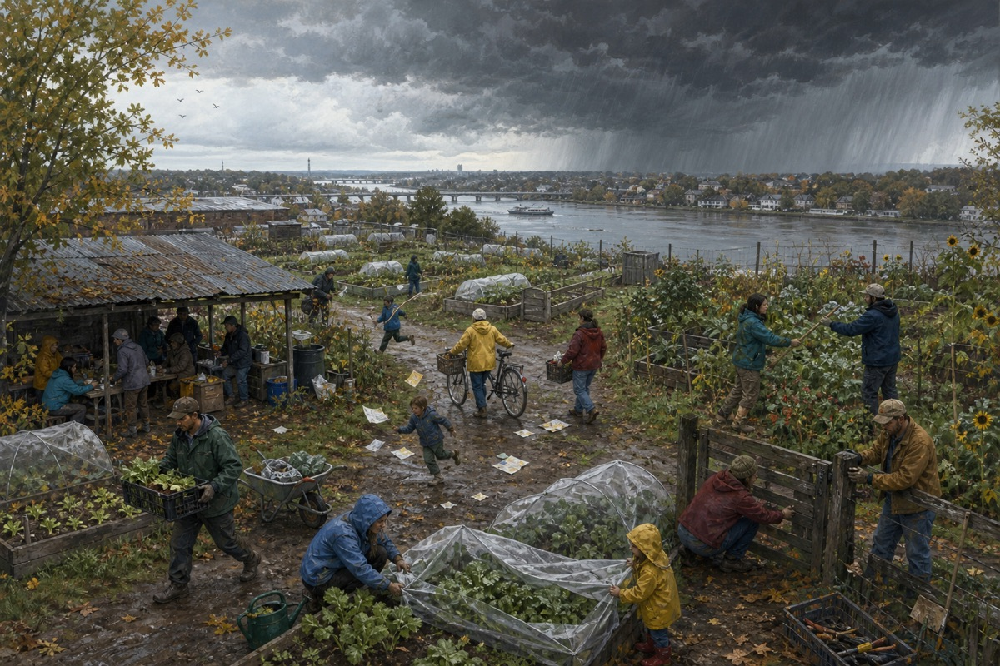<br>
      <sub><strong>Generation focus:</strong> high-viewpoint world organization, seasonal causality, many legible action verbs, layered terrain, and whole-to-detail discovery.<br><strong>Use for:</strong> complex editorial scenes, systems maps, community narratives, and information-rich illustration without class caricature.</sub>
    </td>
    <td width="50%" valign="top">
      <a href="ui-design/skills/hans-holbein-the-younger-style/SKILL.md"><strong>Hans Holbein the Younger Style</strong></a><br>
      <br>
      <sub><strong>Generation focus:</strong> a credibility budget, evidence-based identity objects, role-shaped format, transferable likeness, and bounded uncertainty.<br><strong>Use for:</strong> executive portraiture, institutional editorial systems, provenance-aware profiles, and material-specific product stories.</sub>
    </td>
  </tr>
  <tr>
    <td width="50%" valign="top">
      <a href="ui-design/skills/titian-style/SKILL.md"><strong>Titian Style</strong></a><br>
      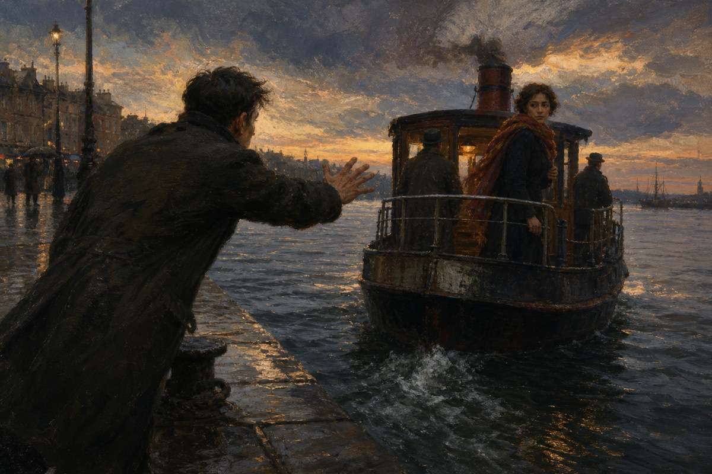<br>
      <sub><strong>Generation focus:</strong> chromatic construction, revision before finish, different touch contracts for each material, a narrative threshold, and multi-distance completion.<br><strong>Use for:</strong> cinematic campaigns, layered editorial imagery, sequential storytelling, and collaborative art direction beyond an Old Master filter.</sub>
    </td>
    <td width="50%" valign="top">
      <a href="ui-design/skills/edvard-munch-style/SKILL.md"><strong>Edvard Munch Style</strong></a><br>
      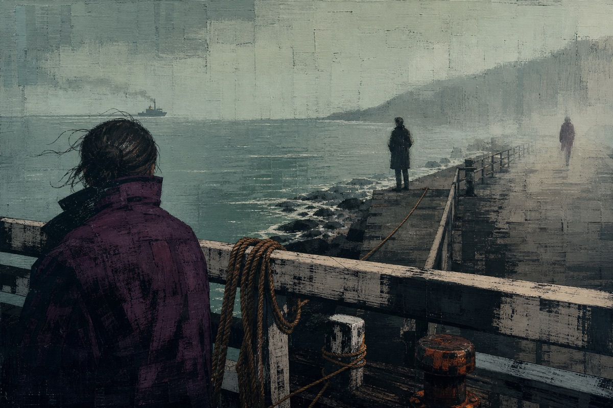<br>
      <sub><strong>Generation focus:</strong> a relational sequence, compressed emotional residue, lines with directional verbs, motif variation, and material-driven recomposition.<br><strong>Use for:</strong> emotional editorial series, motion states, cultural products, and relationship-led narratives without famous icons or diagnostic claims.</sub>
    </td>
  </tr>
</table>

## Repository map

- `*/skills/`: agent-readable design methods, each with a `SKILL.md`
- `*/commands/`: repeatable workflow references for Claude Code and portable agent use
- `ui-design/examples/`: rendered examples and visual references
- `blog/`: WeChat Official Account editorial workflow and themes
- `scripts/build-gemini.sh`: converts plugin skills into Gemini CLI extensions
- `.claude-plugin/marketplace.json`: Claude Code marketplace metadata

## Contributing

Add a focused skill when it captures a repeatable design judgment. Include a clear `SKILL.md`, keep examples close to the skill, and explain when the method should not be used. Small, opinionated contributions are easier to reuse and review.

MIT License.
