# Blog / WeChat Editorial

An editorial production kit for WeChat Official Account articles: choose a visual theme, protect the source text, create mobile-first layout, generate WeChat-ready HTML, inspect screenshots, and optionally prepare a draft.

Adapted from [DUYI WeChat Skill Suite](https://github.com/duyi2076/duyi-wechat-skill-suite). See [NOTICE.md](NOTICE.md) for the integration boundary.

## Skills

| Skill | Role |
| --- | --- |
| `duyi-wechat` | Orchestrates the article workflow |
| `duyi-wechat-css-layer` | Chooses one of 16 Chinese editorial themes |
| `duyi-wechat-paipan` | Formats mobile reading and renders WeChat HTML |
| `duyi-wechat-peitu` | Creates covers and article illustrations |
| `duyi-wechat-fabu` | Runs checks and, only when requested, creates a draft |

The default output is a preview plus WeChat-ready HTML. Publishing is an explicit second step; no credentials or local browser state are included in this repository.

## Theme gallery

Each preview below uses the same [case article](examples/theme-gallery/article.md), rendered at a 390px mobile viewport. The screenshots show the reading surface and hierarchy of each theme; they are examples, not a ranking.

<table>
  <tr>
    <td align="center">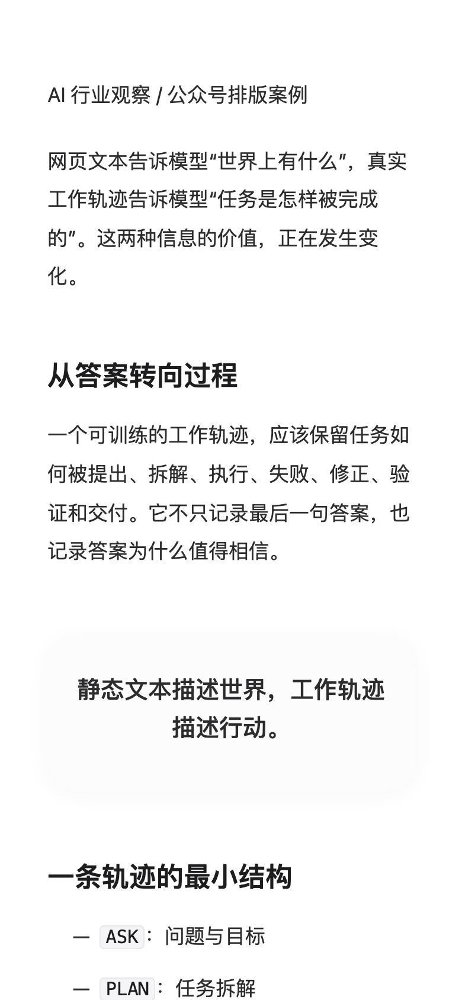<br><strong>白瓷</strong><br><small>品牌 / 产品</small></td>
    <td align="center">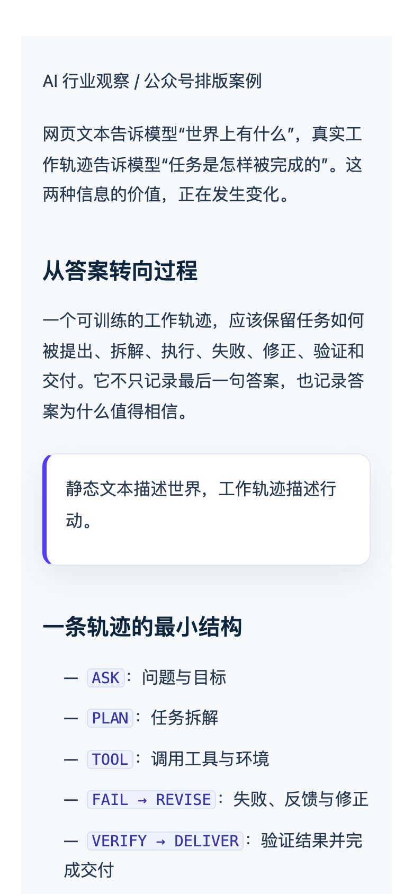<br><strong>蓝图</strong><br><small>产品 / 工具</small></td>
    <td align="center">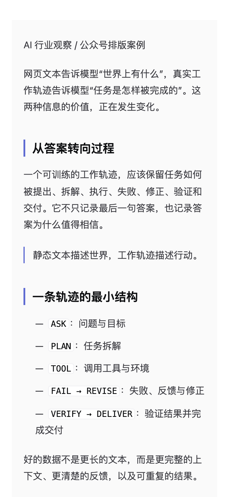<br><strong>紫线</strong><br><small>复盘 / Memo</small></td>
    <td align="center">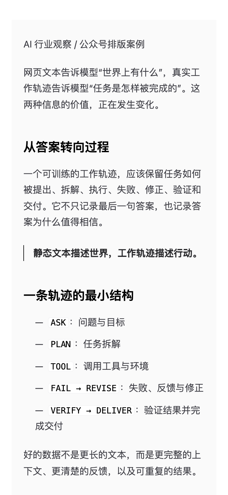<br><strong>墨线</strong><br><small>技术 / 工程</small></td>
  </tr>
  <tr>
    <td align="center">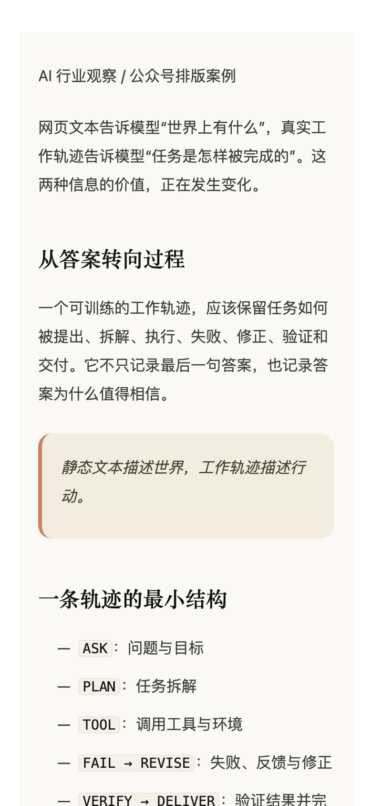<br><strong>陶土</strong><br><small>研究 / 方法论</small></td>
    <td align="center">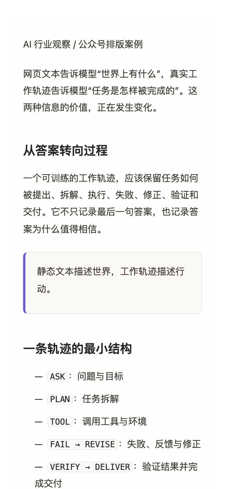<br><strong>宣纸</strong><br><small>SOP / 清单</small></td>
    <td align="center">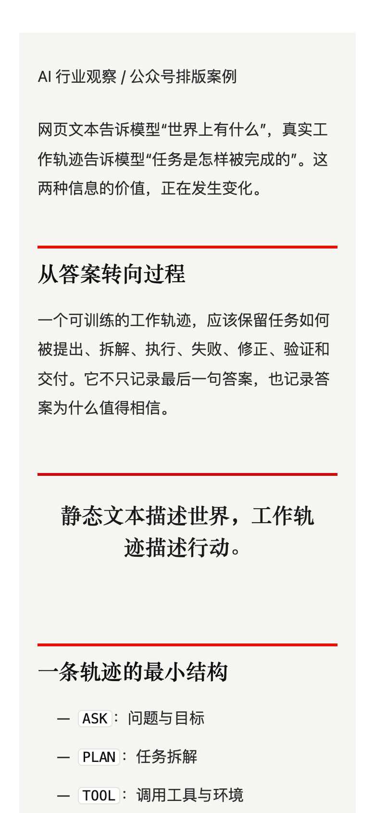<br><strong>朱批</strong><br><small>趋势 / 强观点</small></td>
    <td align="center">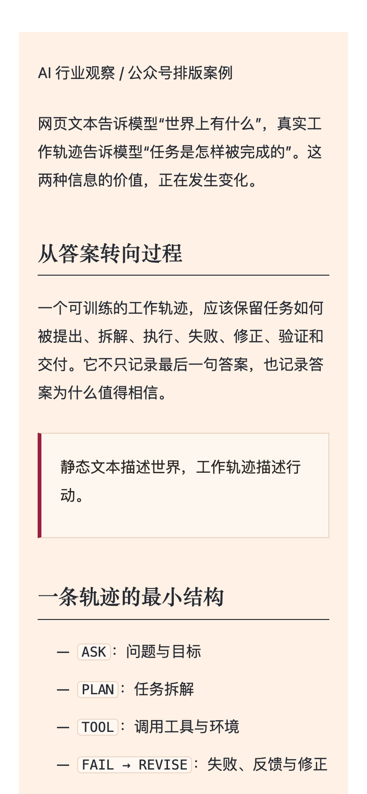<br><strong>杏纸</strong><br><small>财经 / 宏观</small></td>
  </tr>
  <tr>
    <td align="center">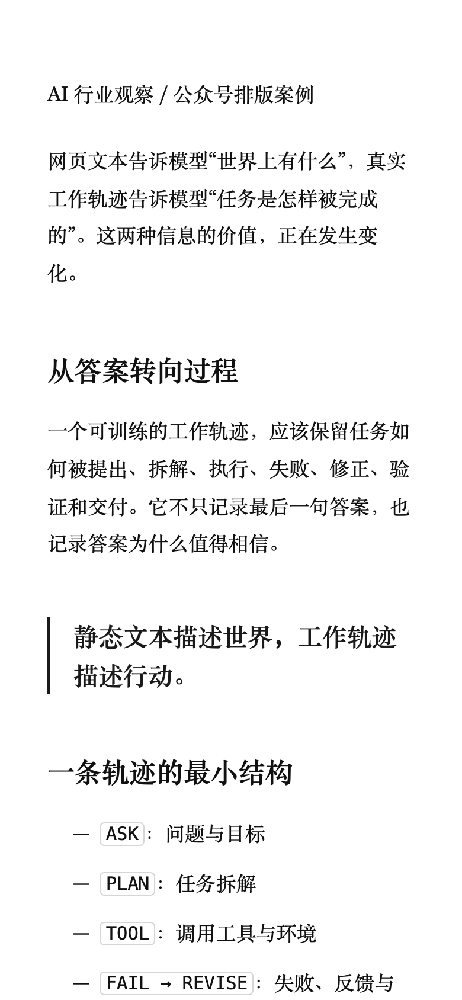<br><strong>素纸</strong><br><small>深度 / 长文</small></td>
    <td align="center">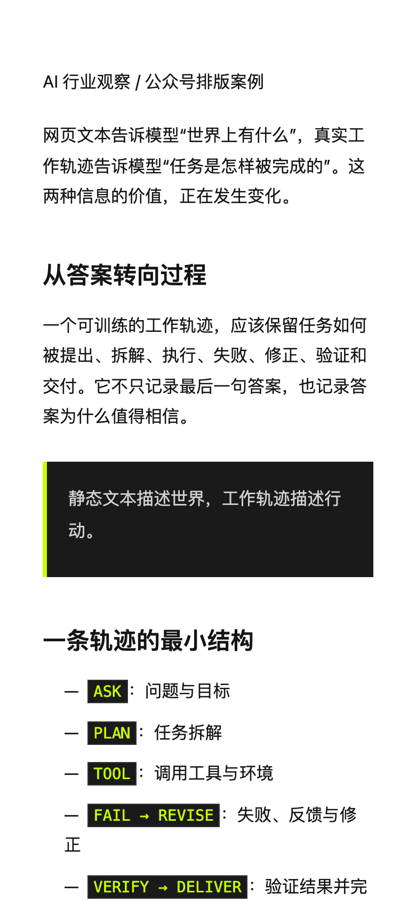<br><strong>萤石</strong><br><small>科技文化 / 锋利观点</small></td>
    <td align="center">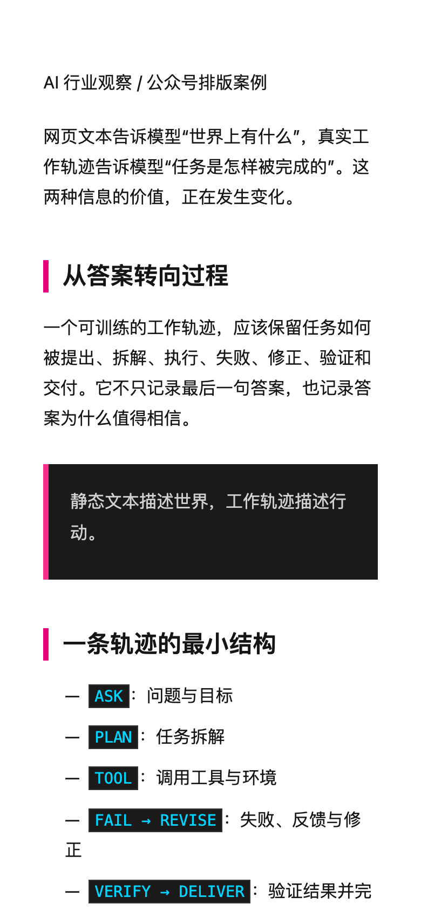<br><strong>霓虹</strong><br><small>新品 / 快讯</small></td>
    <td align="center">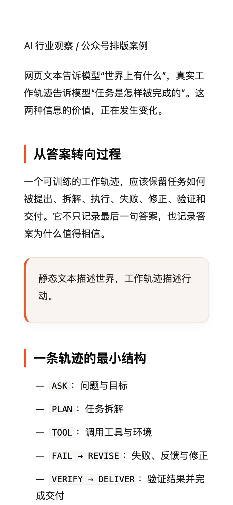<br><strong>橙陶</strong><br><small>设计 / 原型</small></td>
  </tr>
  <tr>
    <td align="center">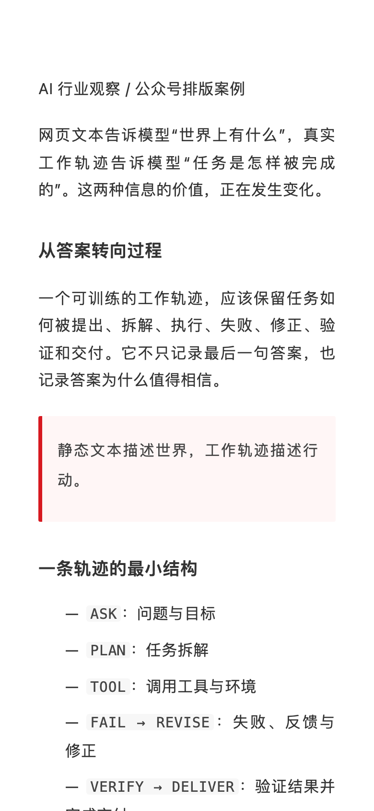<br><strong>朱砂</strong><br><small>实践 / 批注</small></td>
    <td align="center">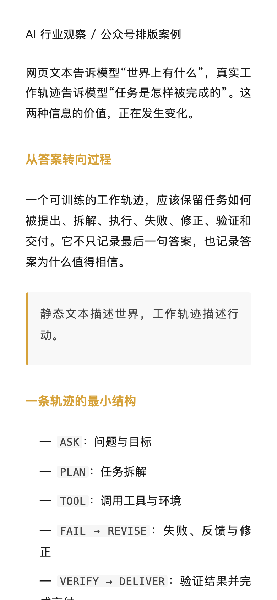<br><strong>金箔</strong><br><small>杂志 / 个人记录</small></td>
    <td align="center">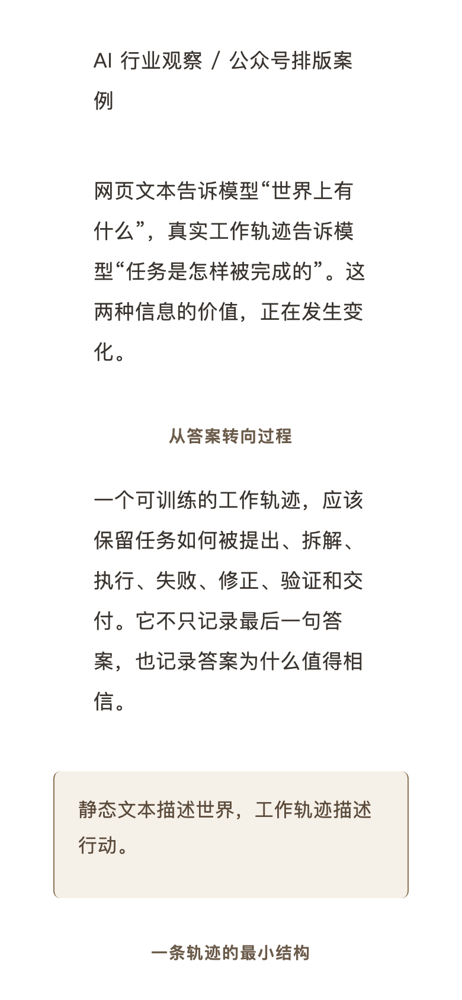<br><strong>竹简</strong><br><small>诗性 / 金句</small></td>
    <td align="center">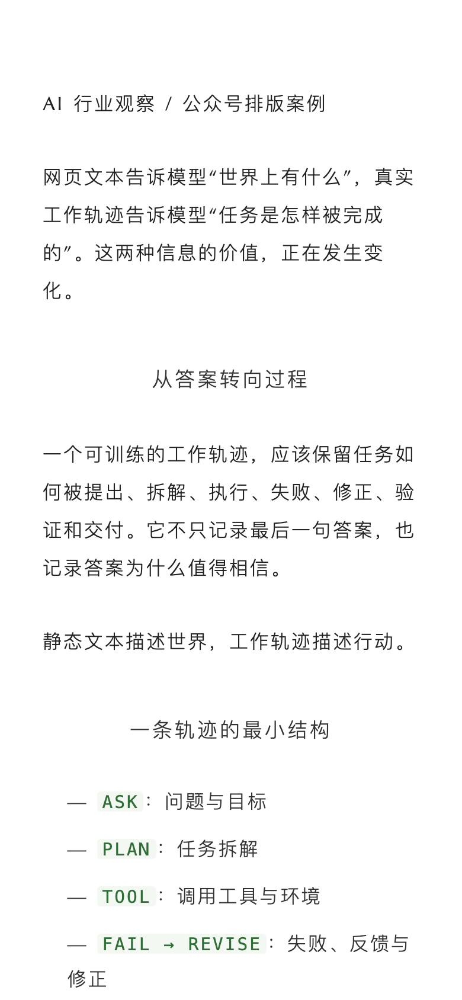<br><strong>青笺</strong><br><small>信件 / 轻教程</small></td>
  </tr>
</table>

## Codex

Install the skills into a project-scoped Codex directory:

```bash
mkdir -p .codex/skills
cp -R /path/to/designer-consultancy/blog/skills/. .codex/skills/
export WECHAT_SKILL_ROOT="$PWD/.codex/skills"
```

For a personal install, use `~/.codex/skills` and set `WECHAT_SKILL_ROOT="$HOME/.codex/skills"`. Start a new Codex session after installation.

## Render a preview

The renderer uses the 16 editorial themes documented in `duyi-wechat-css-layer/templates/styles.md`:

```bash
python3 "${WECHAT_SKILL_ROOT}/duyi-wechat-paipan/scripts/render_wechat_html.py" \
  article.md --style 白瓷 --standalone --output article-preview.html
```

The first local run may need the renderer dependency:

```bash
npm install --prefix "${WECHAT_SKILL_ROOT}/duyi-wechat-paipan/scripts/vendor"
python3 -m pip install -r /path/to/designer-consultancy/blog/requirements.txt
```

Use `duyi-wechat-paipan` for layout-only work. Use `duyi-wechat` for the complete editorial flow. Say `进草稿箱` explicitly before invoking `duyi-wechat-fabu`.
