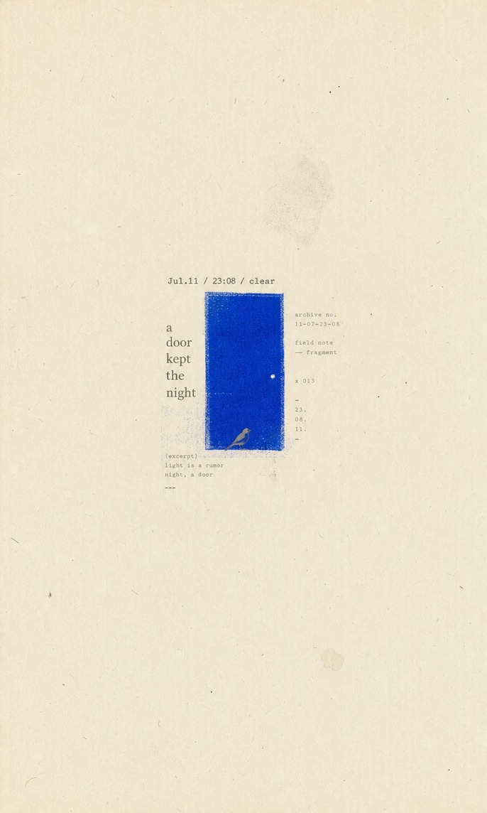

# Minimal Zine Poster

This style turns one idea into a quiet vertical paper poster: a small visual anchor, a short line of type, one saturated print color, and enough empty surface for the image to breathe.

## Template Preview

| Night Door | Yellow Step |
|---|---|
|  |  |

These thumbnails are selected upstream examples from [LiamGvchi/gc-minimal-zine-poster](https://github.com/LiamGvchi/gc-minimal-zine-poster), included under its MIT license. See [NOTICE.md](NOTICE.md).

## Reference Recipe

- Canvas: vertical `3:5` aged paper
- Negative space: `70–90%`
- Subject cluster: `8–25%` of the canvas
- Color: one high-chroma anchor, usually cobalt/ultramarine or a single warm print color
- Type: serif, typewriter, or monospaced; one short phrase plus optional microtext
- Material: xerox, risograph, halftone, letterpress, scan noise, or paper fiber
- Mood: quiet, archival, diary-like, distant, or slightly surreal

The reusable method lives in the sibling [`minimal-zine-poster`](../../skills/minimal-zine-poster/SKILL.md) skill.
